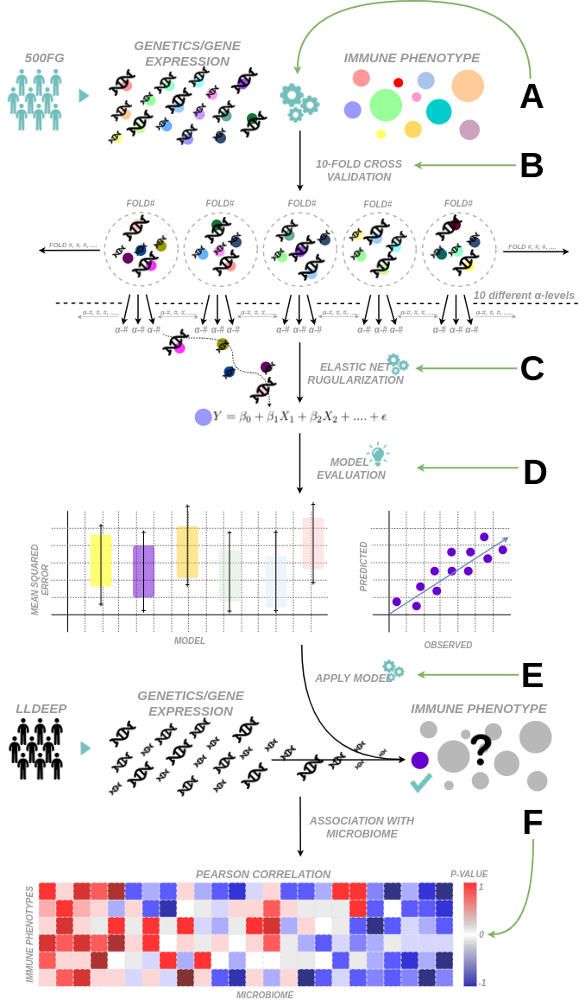

# Interplay Between Gut Microbiome and Immune.System
---

The aim of this research is the identification of causality links between the microbiome composition/function and immune system: does the microbiome influence the immune system (cell counts, cytokines, globulin levels), or/and does the immune system influence the microbiome. We have access to the largest population cohort with gut metagenomic sequencing (LL-DEEP), but this cohort has not been characterized in depth for immune traits.And we have access to another cohort, the human function genome project 500FG which was specifically designed to assess the immune and metabolic system (422 phenotypes available), and also microbiome, but it is very small. This cohort has also genetic and gene expression available. By using gene expression data, genetic data, and transcriptomic data from the 500 Functional Genomic (500FG) cohort a linear model is constructed that explains immune traits/functions between gene expression data, genetic data, genetic data combined gene expression data and the 500FG cohort with Elastic Net Regularization. This constructed model, that is based on genetic data and gene expression data is used to predict immune traits/functions in LL-Deep data which contains genetic, and gene expression data from a large number of individuals which lacks immunogenic information. These predicted immune phenotypes will be used to associate a link with microbial composition/function, see figure 1. 

 Figure 1: Schematic overview of the research project. As described, the goal is to build a model that can predict immune phenotypes. The data used (A) for the this model is gene expression and genetics, and measured immune phenotypes in the 500FG cohort. This data will be processed and splitted randomly in 10 folds (B), which is shown by the different colors. For every fold, this data will enter the elastic net function ten times with different alpha levels (C), so in total this method will be applied 100 times in order to construct a model that can explain a certain immune phenotype. After the model building process, it has to be evaluated which combination of data has the best prediction power (D): genetics, gene expression, or genetics combined with gene expression. When the an appropriate model is chosen, it will be used to predict immune phenotypes in LLDeep (E) with gene expression, genetics, or genetics combined with gene expression data. This will produce immune phenotypes that where not available in this cohort before, and can be used to forecast links between the immune system and microbiome (F). From that point onward it is possible to investigate possible links that can help understand the interplay between the immune system and the microbiome which hopefully can help understand diseases, disease manifestation, or help develop disease treatment which can restore microbiome composition or function. test